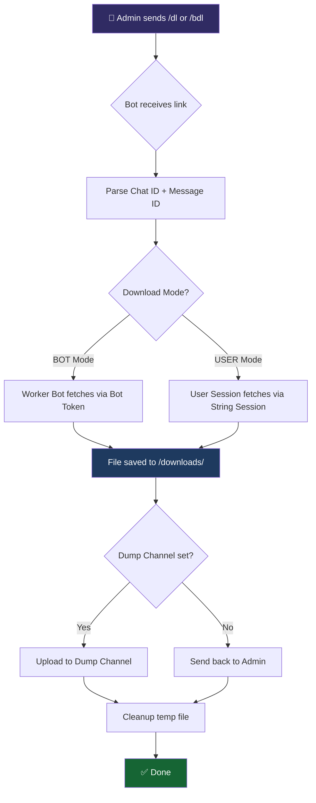

<div align="center">


<br/>

[](https://python.org)
[](https://github.com/pyrogram/pyrogram)
[](LICENSE)
[](https://docker.com)

<br/>


&nbsp;

&nbsp;

&nbsp;


<br/><br/>

> **A production-grade Telegram bot that downloads and re-uploads content from restricted channels and groups — complete with multi-bot worker pooling, auto-resume, batch processing, and a live admin dashboard.**

<br/>

**Developed by [@Paidguy](https://github.com/Paidguy)**  
*Enhanced version of [RestrictedContentDL](https://github.com/bisnuray/RestrictedContentDL) by [@bisnuray](https://github.com/bisnuray)*

</div>

---

## 📑 Table of Contents

- [✨ Features](#-features)
- [🏗️ How It Works](#️-how-it-works)
- [🔑 Prerequisites](#-prerequisites)
- [📦 Installation](#-installation)
  - [Method 1: Local / VPS](#method-1-local--vps)
  - [Method 2: Docker Compose](#method-2-docker-compose)
  - [Method 3: AWS / Cloud with Systemd](#method-3-aws--cloud-with-systemd)
- [🔐 Getting Your Credentials](#-getting-your-credentials)
  - [API ID & API Hash](#api-id--api-hash)
  - [Bot Token](#bot-token)
  - [Session String](#session-string)
- [⚙️ Configuration](#️-configuration)
- [🚀 First Run & Initial Setup](#-first-run--initial-setup)
- [🤖 Bot Commands](#-bot-commands)
- [📊 Admin Dashboard](#-admin-dashboard)
- [🔄 Multi-Bot Worker Pool](#-multi-bot-worker-pool)
- [📁 Project Structure](#-project-structure)
- [🛠️ Troubleshooting](#️-troubleshooting)
- [🤝 Contributing](#-contributing)
- [⚠️ Legal Disclaimer](#️-legal-disclaimer)

---

## ✨ Features

<table>
<tr>
<td width="50%" valign="top">

### ⚡ Core Capabilities
- **Single & Batch Downloads** — Grab one link or thousands with `/dl` and `/bdl`
- **Multi-Bot Worker Pool** — Add unlimited helper bots to multiply throughput
- **BOT + USER Dual Mode** — Switch between bot-token and user-session downloading
- **Smart FloodWait Handling** — Exponential backoff with auto-retry up to 5 times
- **Auto-Resume** — Interrupted batches automatically continue on bot restart
- **Media Group Support** — Albums are downloaded and re-uploaded together

</td>
<td width="50%" valign="top">

### 🛡️ Production-Grade Extras
- **TgCrypto Acceleration** — Hardware-accelerated encryption via `TgCrypto`
- **Live Admin Dashboard** — Real-time RAM, storage, uptime, and active downloads
- **Dump Channel** — Auto-forward all output to a target Telegram channel
- **Authorized Users** — Restrict usage to specific Telegram user IDs
- **Auto Cleanup** — Temp files removed on startup and after each upload
- **Persistent Settings** — All config survives restarts via local JSON files

</td>
</tr>
</table>

---

## 🏗️ How It Works



**The flow in plain terms:**

1. You send a Telegram message link (or a range of links for batch)
2. The bot parses the channel ID and message ID from the URL
3. Depending on the mode, either a bot-token worker or your user session fetches the file
4. The file is downloaded to the server's `/downloads/` folder
5. The file is re-uploaded — either back to your chat or forwarded to a dump channel
6. The temp file is deleted automatically

---

## 🔑 Prerequisites

Before you begin, make sure you have the following:

| Requirement | Details |
|---|---|
| **Python 3.11+** | Required for Pyrofork compatibility |
| **Telegram API credentials** | `API_ID` + `API_HASH` from [my.telegram.org](https://my.telegram.org) |
| **At least one Bot Token** | Created via [@BotFather](https://t.me/BotFather) |
| **A User Session String** | Generated from your Telegram account (for User Mode) |
| **500 MB+ free disk space** | For downloads buffer |
| **Git** | To clone the repository |

> 💡 **You can run in BOT-only mode** without a session string if you don't need to access restricted channels. User Mode is only needed to access content your bot cannot see directly.

---

## 📦 Installation

### Method 1: Local / VPS

This is the simplest method and works on any Linux VPS, Raspberry Pi, or local machine.

**Step 1 — Clone the repository**

```bash
git clone https://github.com/Paidguy/TelegramRestrictionBypass.git
cd TelegramRestrictionBypass
```

**Step 2 — Create a virtual environment (recommended)**

```bash
python3 -m venv venv
source venv/bin/activate
```

**Step 3 — Install dependencies**

```bash
pip install -r requirements.txt
```

The `requirements.txt` installs:
- `Pyrofork` — The maintained Pyrogram fork
- `TgCrypto` — C-level crypto acceleration
- `Pyleaves` — Progress bar utilities
- `python-dotenv` — `.env` file loading
- `psutil` — System stats (RAM, disk)
- `pillow` — Image processing

**Step 4 — Configure your environment**

```bash
cp config.env config.env.bak    # optional backup
nano config.env                 # or use any editor
```

Fill in your credentials (see [Configuration](#️-configuration) below), then save.

**Step 5 — Run the bot**

```bash
python3 main.py
```

On first run, send `/start` to your bot. The **first user** to send `/start` becomes the permanent owner.

---

### Method 2: Docker Compose

Docker is the easiest way to run the bot in production with zero dependency issues.

**Step 1 — Clone and configure**

```bash
git clone https://github.com/Paidguy/TelegramRestrictionBypass.git
cd TelegramRestrictionBypass
nano config.env    # fill in your credentials
```

**Step 2 — Build and start**

```bash
docker compose up -d
```

This will:
- Pull the `python:3.11-slim` base image
- Install all system packages (`ffmpeg`, `build-essential`, etc.)
- Install Python dependencies
- Start the bot in background mode with `restart: always`

**Step 3 — Monitor logs**

```bash
docker compose logs -f
```

**Step 4 — Stop or restart**

```bash
docker compose down          # stop
docker compose restart       # restart
docker compose up -d --build # rebuild and restart after code changes
```

> 📝 **Note:** The `docker-compose.yml` uses `network_mode: "host"` and mounts the project directory as a volume at `/app`, so your `config.env` changes are picked up without rebuilding.

---

### Method 3: AWS / Cloud with Systemd

For a robust, always-on production deployment on Ubuntu/Debian servers.

**Step 1 — Connect to your server and install Python**

```bash
ssh -i your-key.pem ubuntu@YOUR_SERVER_IP
sudo apt update && sudo apt upgrade -y
sudo apt install python3.11 python3.11-venv python3-pip git -y
```

**Step 2 — Clone and set up the project**

```bash
cd /home/ubuntu
git clone https://github.com/Paidguy/TelegramRestrictionBypass.git
cd TelegramRestrictionBypass
python3.11 -m venv venv
source venv/bin/activate
pip install -r requirements.txt
nano config.env    # fill in credentials
```

**Step 3 — Create a systemd service**

```bash
sudo nano /etc/systemd/system/tgbypass.service
```

Paste the following, adjusting paths if needed:

```ini
[Unit]
Description=Telegram Restriction Bypass Bot
After=network-online.target
Wants=network-online.target

[Service]
Type=simple
User=ubuntu
WorkingDirectory=/home/ubuntu/TelegramRestrictionBypass
ExecStart=/home/ubuntu/TelegramRestrictionBypass/venv/bin/python3 main.py
Restart=always
RestartSec=10
StandardOutput=journal
StandardError=journal

[Install]
WantedBy=multi-user.target
```

**Step 4 — Enable and start the service**

```bash
sudo systemctl daemon-reload
sudo systemctl enable tgbypass
sudo systemctl start tgbypass
```

**Step 5 — Check status and logs**

```bash
sudo systemctl status tgbypass
sudo journalctl -u tgbypass -f    # live logs
```

> 💡 **AWS tip:** If you see frequent `ConnectionResetError` on AWS EC2 with Debian/Ubuntu, disable IPv6 to resolve it:
> ```bash
> sudo sysctl -w net.ipv6.conf.all.disable_ipv6=1
> sudo sysctl -w net.ipv6.conf.default.disable_ipv6=1
> # Make persistent:
> echo "net.ipv6.conf.all.disable_ipv6 = 1" | sudo tee -a /etc/sysctl.conf
> ```

---

## 🔐 Getting Your Credentials

### API ID & API Hash

1. Go to [https://my.telegram.org](https://my.telegram.org)
2. Log in with your phone number
3. Click **"API development tools"**
4. Fill in the app form (App title and short name can be anything)
5. Copy your `App api_id` and `App api_hash`

> ⚠️ **Never share these with anyone.** They are tied to your Telegram account.

---

### Bot Token

1. Open Telegram and search for [@BotFather](https://t.me/BotFather)
2. Send `/newbot`
3. Choose a display name and a unique username (must end in `bot`)
4. BotFather will reply with a token like `123456789:ABCdef...`
5. Copy that — it's your `BOT_TOKENS` value

**To add multiple bot tokens** (for the worker pool), comma-separate them:

```env
BOT_TOKENS=111111:AAA...,222222:BBB...,333333:CCC...
```

The first token is the **main bot**. The rest are automatically added as workers.

---

### Session String

The session string allows the bot to act as your Telegram user account to access restricted channels that your bots cannot join.

**Option A — Use Pyrofork's built-in session generator (recommended)**

```python
# Save this as gen_session.py and run it once
from pyrogram import Client

async def main():
    async with Client("my_session", api_id=YOUR_API_ID, api_hash="YOUR_API_HASH") as app:
        print(await app.export_session_string())

import asyncio
asyncio.run(main())
```

```bash
python3 gen_session.py
```

Enter your phone number and the OTP code when prompted. The output is your `SESSION_STRING`.

**Option B — Use a web-based generator**  
Trusted community tools like [SessionStringGenerator](https://t.me/SessionStringBot) can generate it via bot. Always verify you trust the source before entering credentials.

> 🔒 After generating, you can delete `my_session.session` — the string is what matters. Store it securely and never commit it to Git.

---

## ⚙️ Configuration

Edit `config.env` with your values. Every variable is explained below.

```env
# ─────────────────────────────────────────────
# 🔑  TELEGRAM API CREDENTIALS
# ─────────────────────────────────────────────

# From https://my.telegram.org → API Development Tools
API_ID=12345678
API_HASH=abcdef1234567890abcdef1234567890

# ─────────────────────────────────────────────
# 🤖  BOT TOKENS
# ─────────────────────────────────────────────

# Single bot:
# BOT_TOKENS=123456:ABC-DEF1234...
#
# Multiple bots (comma-separated) — first is main, rest become workers:
BOT_TOKENS=111111:AAA...,222222:BBB...,333333:CCC...

# ─────────────────────────────────────────────
# 🔐  USER SESSION (for User Mode)
# ─────────────────────────────────────────────

# Leave empty to run in BOT-only mode
SESSION_STRING=YOUR_SESSION_STRING_HERE

# ─────────────────────────────────────────────
# ⚙️  PERFORMANCE SETTINGS
# ─────────────────────────────────────────────

# Maximum simultaneous downloads (default: 5)
# Reduce to 2-3 if you hit rate limits
MAX_CONCURRENT_DOWNLOADS=5

# Seconds to wait between batch chunks (default: 2)
# Increase to 5-10 if you hit FloodWait errors frequently
FLOOD_WAIT_DELAY=2

# Number of message IDs fetched per batch API call (default: 200)
# Lower this if you get timeout errors on slow servers
BATCH_SIZE=200
```

### Variable Reference Table

| Variable | Default | Description |
|---|---|---|
| `API_ID` | — | Telegram API app ID from my.telegram.org |
| `API_HASH` | — | Telegram API app hash from my.telegram.org |
| `BOT_TOKENS` | — | One or more bot tokens, comma-separated |
| `SESSION_STRING` | `""` | User session string (optional, for User Mode) |
| `MAX_CONCURRENT_DOWNLOADS` | `5` | Max parallel downloads at once |
| `FLOOD_WAIT_DELAY` | `2` | Seconds between batch API calls |
| `BATCH_SIZE` | `200` | Message IDs per batch API call |

---

## 🚀 First Run & Initial Setup

**1. Start the bot and claim ownership**

Send `/start` to your bot in Telegram. The **very first user** to do this becomes the permanent owner and is saved to `downloads/owner_id.txt`. This is reset only if you delete that file.

**2. Check the dashboard**

After `/start`, you'll see a live dashboard showing uptime, active downloads, RAM, disk space, and current mode.

**3. (Optional) Set a dump channel**

If you want all downloads forwarded to a Telegram channel instead of directly to your chat:

1. Create a Telegram channel
2. Add your bot as an **Administrator** with "Post Messages" permission
3. The bot detects this automatically and saves the channel as the dump target

You can verify it's set in the dashboard under **"📂 Destination"**.

**4. (Optional) Authorize additional users**

Only the owner can use the bot by default. To authorize other users:

```
/auth 987654321
```

Replace `987654321` with the target user's Telegram numeric ID.

**5. (Optional) Switch to User Mode**

By default the bot runs in **BOT Mode** (uses bot tokens to fetch content). If you need to access channels restricted to users only, switch to User Mode via the dashboard toggle button, or the `/start` settings panel. User Mode uses your `SESSION_STRING`.

---

## 🤖 Bot Commands

All commands work in **private chat** with the bot. Only the owner and authorized users can use them.

| Command | Arguments | Description |
|---|---|---|
| `/start` | — | Open the admin dashboard |
| `/dl` | `<link>` | Download a single message by Telegram link |
| `/bdl` | `<start_link> <end_link>` | Batch download a range of messages |
| `/connect` | `<bot_token>` | Add a new bot to the worker pool at runtime |
| `/join` | `<chat_username_or_link>` | Join a chat with the user session (User Mode only) |
| `/auth` | `<user_id>` | Authorize a new user (owner only) |
| `/logs` | — | Download the current `logs.txt` file |
| `/clean` | — | Wipe all files in the `downloads/` directory |

### Usage Examples

**Download a single post:**
```
/dl https://t.me/channelname/123
```

**Batch download messages 100 through 500:**
```
/bdl https://t.me/channelname/100 https://t.me/channelname/500
```

**Add a second bot as a worker:**
```
/connect 987654321:ABC-NewBotToken...
```

**Join a private channel as the user:**
```
/join https://t.me/+privateInviteHash
```

---

## 📊 Admin Dashboard

Sending `/start` shows the live dashboard:

```
🤖 Restricted Content Downloader
━━━━━━━━━━━━━━━━━━━━━
⚡ Active DLs: 3 | Tasks: 5
🤖 Worker Bots: 2 active
⏱ Uptime: 2h 14m 33s
💾 Storage: 12.4 GB free
🧠 RAM Load: 42%
━━━━━━━━━━━━━━━━━━━━━
📂 Destination: Channel `-1001234567890`
🛠 Current Mode: BOT
```

**Dashboard Buttons:**

| Button | Action |
|---|---|
| 🔄 Refresh | Refresh the dashboard stats |
| ⚙️ Settings | Toggle concurrent speed and flood delay |
| 🤖 Manage Bots | View, add, or remove worker bots |
| 👤 User Mode / 🤖 Bot Mode | Toggle between download modes |
| 📜 Logs | Send `logs.txt` to chat |
| 🛑 STOP ALL | Cancel all running download tasks immediately |

**Settings panel** (accessible via ⚙️ Settings):

- **⚡ Speed** — Toggle between `3x` and `5x` concurrent downloads
- **⏳ Delay** — Toggle between `0s` and `2s` inter-request delay

---

## 🔄 Multi-Bot Worker Pool

One of the most powerful features: add multiple Telegram bots as download workers. Each worker handles its own upload slot, multiplying the total throughput.

### How Workers Are Managed

- On startup, all tokens listed in `BOT_TOKENS` are automatically started as workers
- Additional bots added via `/connect` are saved persistently in `downloads/extra_bots.txt` and reloaded on every restart
- Workers are distributed in **round-robin** fashion — each download task is assigned to the next available connected worker
- If a worker's token becomes invalid, it is automatically removed from the pool and the download is retried with another worker

### Adding a Worker at Runtime

```
/connect 987654321:ABCdef-NewWorkerBotToken
```

On success the bot replies: `✅ Connected: WorkerBotName`

### Removing a Worker

Open the dashboard → 🤖 **Manage Bots** → tap the 🗑 icon next to any non-main bot.

> ⚠️ The **main bot** (first token in `BOT_TOKENS`) cannot be removed — it's the control plane.

---

## 📁 Project Structure

```
TelegramRestrictionBypass/
│
├── main.py                  # Entry point — bot initialization, all handlers, core logic
├── config.py                # Loads config.env into the PyroConf class
├── logger.py                # Logging setup (outputs to logs.txt)
│
├── helpers/
│   ├── files.py             # Download path management, file size checks, cleanup
│   ├── msg.py               # Message parsing, caption handling, file naming
│   ├── settings.py          # Persistent config manager (ConfigManager class)
│   ├── state.py             # Batch progress state (StateManager class)
│   └── utils.py             # Media group processing, upload helpers, progress bars
│
├── downloads/               # Runtime directory (created automatically)
│   ├── settings.json        # Saved bot settings
│   ├── owner_id.txt         # Persisted owner Telegram ID
│   ├── dump_target.txt      # Saved dump channel ID
│   ├── extra_bots.txt       # Saved extra bot tokens
│   ├── user_state.json      # Batch progress for auto-resume
│   └── history.txt          # Download history log
│
├── requirements.txt         # Python dependencies
├── config.env               # Your credentials and settings (never commit this!)
├── Dockerfile               # Docker image build instructions
├── docker-compose.yml       # Docker Compose service definition
└── README.md                # This file
```

### Key Runtime Files

| File | Purpose | Reset by deleting? |
|---|---|---|
| `downloads/owner_id.txt` | Stores the owner's Telegram user ID | Yes — next `/start` sets a new owner |
| `downloads/settings.json` | Speed, delay, authorized users, mode | Yes — reverts to defaults |
| `downloads/dump_target.txt` | Dump channel ID | Yes — clears dump channel |
| `downloads/extra_bots.txt` | Persisted extra bot tokens | Yes — removes extra workers on restart |
| `downloads/user_state.json` | Active batch progress | Yes — disables auto-resume |

---

## 🛠️ Troubleshooting

<details>
<summary><b>❌ "Session string is invalid" or user client fails to start</b></summary>

**Cause:** The `SESSION_STRING` in `config.env` is expired, incorrect, or from a different account.

**Fix:**
1. Re-generate a fresh session string (see [Getting Your Credentials → Session String](#session-string))
2. Replace the value in `config.env`
3. Restart the bot

The bot will continue in BOT-only mode even if the user session fails — you'll see a warning in the logs.
</details>

<details>
<summary><b>❌ Frequent FloodWait errors</b></summary>

**Cause:** You're making too many API requests too quickly. Telegram imposes rate limits.

**Fix:**
- Increase `FLOOD_WAIT_DELAY` to `5` or `10` in `config.env`
- Reduce `MAX_CONCURRENT_DOWNLOADS` to `2`
- Add more worker bots via `/connect` to spread the load
- The bot automatically waits and retries up to 5 times before giving up on a message
</details>

<details>
<summary><b>❌ ConnectionResetError on AWS / Debian</b></summary>

**Cause:** AWS networking conflicts with IPv6 by default on some images.

**Fix:**
```bash
# Disable IPv6 for this session
sudo sysctl -w net.ipv6.conf.all.disable_ipv6=1
sudo sysctl -w net.ipv6.conf.default.disable_ipv6=1

# Persist across reboots
echo "net.ipv6.conf.all.disable_ipv6 = 1" | sudo tee -a /etc/sysctl.conf
echo "net.ipv6.conf.default.disable_ipv6 = 1" | sudo tee -a /etc/sysctl.conf
sudo sysctl -p
```
</details>

<details>
<summary><b>❌ MD5_CHECKSUM_INVALID during download</b></summary>

**Cause:** Network instability caused a corrupted chunk during download.

**Fix:**
- The bot retries automatically on this error (up to 2 retries)
- Ensure your server has a stable, low-latency connection to Telegram's servers (Telegram DC locations are Frankfurt, Miami, Singapore, Amsterdam, Singapore)
- Verify TgCrypto is installed: `pip show TgCrypto`
- If on Docker: `docker compose exec media_bot pip show TgCrypto`
</details>

<details>
<summary><b>❌ Disk fills up quickly</b></summary>

**Cause:** Failed or large downloads accumulate in `downloads/`.

**Fix:**
- Send `/clean` to the bot to wipe `downloads/*`
- Manually: `rm -rf downloads/*` (keep `.txt` and `.json` files if you want to preserve settings)
- Files are cleaned automatically after each successful upload; this only accumulates on errors
</details>

<details>
<summary><b>❌ Bot not responding to messages</b></summary>

**Fix checklist:**
1. Confirm the bot is running: `systemctl status tgbypass` or `docker compose ps`
2. Check that `BOT_TOKENS` is correctly set in `config.env`
3. Ensure you are messaging the bot in **private chat** — all commands are private-only
4. Confirm your Telegram user ID is authorized (first `/start` sets you as owner)
5. Check the logs: `sudo journalctl -u tgbypass -f` or `docker compose logs -f`
</details>

<details>
<summary><b>❌ Batch stops midway and doesn't resume</b></summary>

**Cause:** The batch state is saved in `downloads/user_state.json`. If the bot restarts before a batch finishes, it auto-resumes. If it doesn't, the state file may be corrupted.

**Fix:**
```bash
cat downloads/user_state.json    # inspect state
rm downloads/user_state.json     # reset if corrupted
```

You can then restart the batch manually using `/bdl`.
</details>

---

## 🤝 Contributing

Contributions are welcome! Here's how to get involved:

```bash
# 1. Fork the repository on GitHub, then clone your fork
git clone https://github.com/YOUR_USERNAME/TelegramRestrictionBypass.git
cd TelegramRestrictionBypass

# 2. Create a feature branch
git checkout -b feature/your-feature-name

# 3. Make your changes
# ...

# 4. Commit with a clear message
git add .
git commit -m "feat: add your feature description"

# 5. Push and open a Pull Request
git push origin feature/your-feature-name
```

**Guidelines:**
- Follow PEP 8 style
- Keep helper logic in the `helpers/` modules, not in `main.py`
- Add comments for non-obvious logic
- Test with both BOT mode and USER mode before submitting
- Update this README if you add new config variables or commands

---

## 📜 License

This project is licensed under the **MIT License** — see [LICENSE](LICENSE) for full terms.

---

## 👨‍💻 Credits

<div align="center">

**Primary Developer**  
[@Paidguy](https://github.com/Paidguy)

**Original Project**  
[RestrictedContentDL](https://github.com/bisnuray/RestrictedContentDL) by [@bisnuray](https://github.com/bisnuray)

**Core Libraries**  
[Pyrofork](https://github.com/pyrogram/pyrogram) · [TgCrypto](https://github.com/pyrogram/tgcrypto) · [Pyleaves](https://github.com/1Danish-00/pyleaves)

<br/>

[](https://github.com/Paidguy)
[](https://t.me/paidguy)

*If this project helped you, please ⭐ star both this repo and the [original](https://github.com/bisnuray/RestrictedContentDL)!*

</div>

---

## ⚠️ Legal Disclaimer

<div align="center">

### **THIS SOFTWARE IS PROVIDED FOR EDUCATIONAL AND RESEARCH PURPOSES ONLY**

</div>

By using this software you acknowledge and agree to the following:

**Terms of Service:** This bot may violate [Telegram's Terms of Service](https://telegram.org/tos). Using it may result in **permanent account suspension** of any Telegram account (bot or user) associated with it.

**Copyright Law:** Downloading or redistributing restricted content without authorization may infringe on intellectual property rights and violate laws such as the DMCA (US), EU Copyright Directive, Computer Misuse Act (UK), and equivalent legislation in your country.

**Your Responsibility:** You are **solely responsible** for how you use this software, including any legal consequences, account bans, or financial penalties that result. The developers disclaim all liability.

**Permitted use only:** This software should only be used for content you own, have explicit permission to download, or in clearly authorized educational/research contexts.

> 🚨 **Do not use this software to pirate, redistribute, or profit from content you do not own. If in doubt, consult a legal professional before use.**

---

<div align="center">


**Built with [Pyrofork](https://github.com/pyrogram/pyrogram) · Powered by Python 3.11 · Use Responsibly**

*Last updated: February 2026*

</div>
