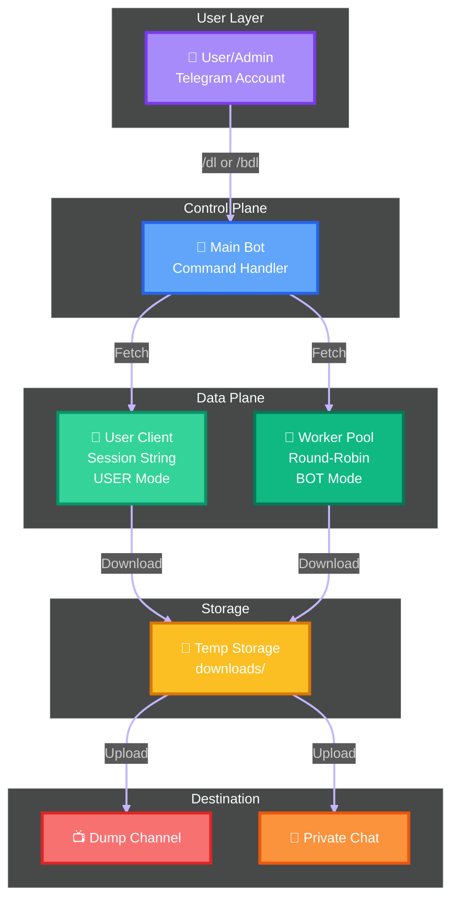
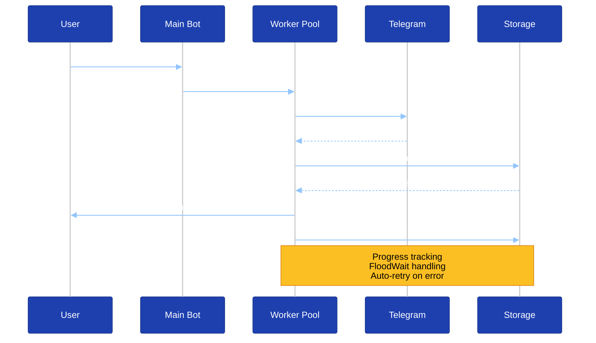
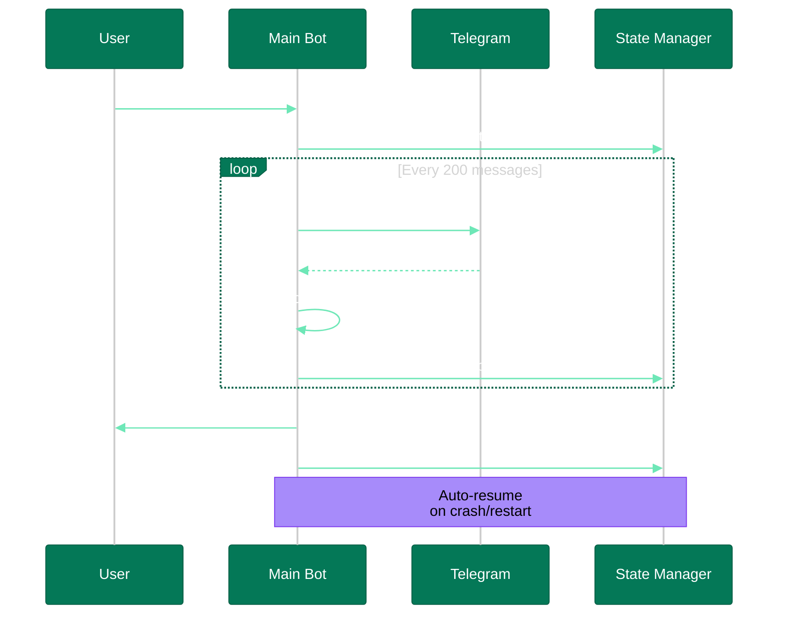

# 🚀 TelegramRestrictionBypass

<div align="center">


</div>

<div align="center">

<!-- Badges Section with Enhanced Styling -->
<p align="center">
  <a href="LICENSE"></a>
  <a href="#"></a>
  <a href="#"></a>
  <a href="#"></a>
  <a href="#"></a>
</p>

<p align="center">
  
  
  
  
  
  
</p>

</div>

<br/>

<div align="center">

<picture>
  <source media="(prefers-color-scheme: dark)" srcset="https://readme-typing-svg.demolab.com?font=Fira+Code&weight=600&size=24&duration=3000&pause=1000&color=58A6FF&center=true&vCenter=true&multiline=true&repeat=true&width=800&height=100&lines=🎯+Production-grade+Telegram+content+downloader;⚡+Multi-bot+worker+pools+•+Crash-safe+auto-resume;📊+Live+dashboard+•+Smart+media+handling">
  
</picture>

</div>

<br/>

<div align="center">


**[✨ Features](#-features) • [🎬 Visual Showcase](#-visual-showcase) • [🚀 Quick Start](#-quick-start) • [📦 Installation](#-installation) • [📚 Documentation](#-documentation) • [💬 Support](#-support)**

</div>

<br/>

<div align="center">


</div>

<br/>

---

## 📖 Overview

<div align="center">

### 💎 Why Choose TelegramRestrictionBypass?

<table>
<tr>
<td align="center" width="20%">

<br/><b>Production Ready</b>
<br/><sub>Battle-tested<br/>& reliable</sub>
</td>
<td align="center" width="20%">

<br/><b>Lightning Fast</b>
<br/><sub>TgCrypto<br/>acceleration</sub>
</td>
<td align="center" width="20%">

<br/><b>Crash Safe</b>
<br/><sub>Auto-resume<br/>built-in</sub>
</td>
<td align="center" width="20%">

<br/><b>Highly Scalable</b>
<br/><sub>Multi-bot<br/>worker pools</sub>
</td>
<td align="center" width="20%">

<br/><b>Easy to Use</b>
<br/><sub>5-minute<br/>setup</sub>
</td>
</tr>
</table>

<br/>


</div>

<br/>

<div align="center">

<table>
<tr>
<td width="50%" valign="top">

### 🎯 What It Does

**TelegramRestrictionBypass** is a powerful, production-ready Telegram bot that downloads and re-uploads content from Telegram channels—**including restricted content**. Built with scalability and reliability in mind.

Perfect for:
- 📚 **Archiving channels**
- 🎬 **Downloading media collections**
- 🔄 **Content aggregation workflows**
- 💾 **Personal backups**
- 📊 **Research & education**

</td>
<td width="50%" valign="top">

### ⚡ Why Choose This?

```diff
+ Multi-bot worker pools
+ Crash-safe auto-resume
+ Dual BOT/USER modes
+ Live admin dashboard
+ Smart media handling
+ Production-ready features
+ TgCrypto acceleration
+ Zero data loss guarantee
```

</td>
</tr>
</table>

</div>

<br/>

<div align="center">

### 🌟 Key Highlights

<table>
<tr>
<td align="center" width="25%">

<br/><b>Multi-Bot Pools</b>
<br/><sub>Round-robin distribution<br/>for parallel uploads</sub>
</td>
<td align="center" width="25%">

<br/><b>Auto-Resume</b>
<br/><sub>Crash-safe state<br/>recovery system</sub>
</td>
<td align="center" width="25%">

<br/><b>Live Dashboard</b>
<br/><sub>Real-time stats<br/>& monitoring</sub>
</td>
<td align="center" width="25%">

<br/><b>High Performance</b>
<br/><sub>Concurrent downloads<br/>TgCrypto boost</sub>
</td>
</tr>
</table>

</div>

<br/>

<div align="center">


</div>

---

## 🎬 Visual Showcase

<div align="center">

### See It In Action

<table>
<tr>
<td align="center" width="50%">

**📊 Live Dashboard**


*Real-time monitoring and control*

</td>
<td align="center" width="50%">

**⚡ Batch Processing**


*Thousands of files at once*

</td>
</tr>
<tr>
<td align="center">

**🤖 Multi-Bot Worker Pool**


*Parallel uploads for speed*

</td>
<td align="center">

**📺 Dump Channel Integration**


*Auto-forward to channels*

</td>
</tr>
</table>

<br/>


</div>

<br/>

<div align="center">


</div>

---

## ✨ Features

<div align="center">

<table>
<tr>
<td width="50%" valign="top">

### 🎯 Core Functionality

<table>
<tr>
<td align="center" width="10%">🔗</td>
<td width="90%">
<b>Single Download</b><br/>
<code>/dl &lt;link&gt;</code> - Download any Telegram message instantly
</td>
</tr>
<tr>
<td align="center">⚡</td>
<td>
<b>Batch Download</b><br/>
<code>/bdl &lt;start&gt; &lt;end&gt;</code> - Download thousands in one command
</td>
</tr>
<tr>
<td align="center">🤖</td>
<td>
<b>BOT Mode</b><br/>
Uses bot tokens to fetch public channel content
</td>
</tr>
<tr>
<td align="center">👤</td>
<td>
<b>USER Mode</b><br/>
Uses your Telegram account for restricted/private channels
</td>
</tr>
<tr>
<td align="center">🖼️</td>
<td>
<b>Media Groups</b><br/>
Albums kept intact and re-uploaded together
</td>
</tr>
<tr>
<td align="center">🔄</td>
<td>
<b>Auto-Resume</b><br/>
Interrupted batches restart automatically on system reboot
</td>
</tr>
</table>

</td>
<td width="50%" valign="top">

### 🛡️ Production Features

<table>
<tr>
<td align="center" width="10%">🤖</td>
<td width="90%">
<b>Multi-Bot Worker Pool</b><br/>
Add unlimited worker bots for parallel uploads
</td>
</tr>
<tr>
<td align="center">📊</td>
<td>
<b>Live Dashboard</b><br/>
Real-time RAM, storage, uptime, and worker stats
</td>
</tr>
<tr>
<td align="center">📺</td>
<td>
<b>Dump Channel</b><br/>
Forward all downloads to a Telegram channel
</td>
</tr>
<tr>
<td align="center">⏳</td>
<td>
<b>FloodWait Handling</b><br/>
Exponential backoff with automatic retry (up to 5×)
</td>
</tr>
<tr>
<td align="center">🔐</td>
<td>
<b>User Authorization</b><br/>
Owner-only by default, authorize additional users
</td>
</tr>
<tr>
<td align="center">💾</td>
<td>
<b>Persistent Settings</b><br/>
Configuration survives restarts
</td>
</tr>
</table>

</td>
</tr>
</table>

</div>

<br/>

<div align="center">

### ⚙️ Technical Highlights

<table>
<tr>
<td align="center" width="20%">

<br/><b>TgCrypto</b>
<br/><sub>Fast C-level encryption<br/>~10× faster</sub>
</td>
<td align="center" width="20%">

<br/><b>Asyncio</b>
<br/><sub>Semaphore-controlled<br/>parallel downloads</sub>
</td>
<td align="center" width="20%">

<br/><b>FFmpeg</b>
<br/><sub>Video metadata<br/>& thumbnails</sub>
</td>
<td align="center" width="20%">

<br/><b>Failover</b>
<br/><sub>Bad tokens<br/>auto-removed</sub>
</td>
<td align="center" width="20%">

<br/><b>Progress Bars</b>
<br/><sub>Beautiful indicators<br/>with Pyleaves</sub>
</td>
</tr>
</table>

</div>

<br/>

<div align="center">


</div>

---

## 🚀 Quick Start

<div align="center">


</div>

<br/>

<div align="center">

### 📋 Prerequisites Checklist

<table>
<tr>
<td align="center" width="25%">

<br/><b>Python 3.11+</b>
<br/><sub>Required</sub>
</td>
<td align="center" width="25%">

<br/><b>Telegram Account</b>
<br/><sub>Required</sub>
</td>
<td align="center" width="25%">

<br/><b>API Credentials</b>
<br/><sub>From my.telegram.org</sub>
</td>
<td align="center" width="25%">

<br/><b>Bot Token</b>
<br/><sub>From @BotFather</sub>
</td>
</tr>
</table>

</div>

### ⚡ 5-Minute Setup

<div align="center">


</div>

<table>
<tr>
<td width="50%" valign="top">

#### 🔽 Step 1: Clone Repository

```bash
git clone https://github.com/Paidguy/TelegramRestrictionBypass.git
cd TelegramRestrictionBypass
```

#### 📦 Step 2: Install Dependencies

```bash
python3.11 -m venv venv
source venv/bin/activate  # Windows: venv\Scripts\activate
pip install -r requirements.txt
```

</td>
<td width="50%" valign="top">

#### ⚙️ Step 3: Configure

```bash
cp config.env.example config.env
nano config.env  # Add your credentials
```

#### ▶️ Step 4: Run

```bash
python main.py
```

**🎉 Send `/start` to your bot in Telegram!**

</td>
</tr>
</table>

<div align="center">

<br/>

### 📖 Need More Help?

<div align="center">

<table>
<tr>
<td align="center" width="33%">
<a href="docs/QUICKSTART.md">

<br/><b>Quick Start Guide</b>
</a>
<br/><sub>5-minute condensed</sub>
</td>
<td align="center" width="33%">
<a href="docs/INSTALLATION.md">

<br/><b>Installation Guide</b>
</a>
<br/><sub>Complete setup</sub>
</td>
<td align="center" width="33%">
<a href="docs/SETUP.md">

<br/><b>Configuration</b>
</a>
<br/><sub>Detailed reference</sub>
</td>
</tr>
</table>

</div>

<br/>

<div align="center">


</div>

---

## 🐳 Docker Deployment

<div align="center">


</div>

<br/>

### Quick Docker Start

```bash
# 1. Clone and configure
git clone https://github.com/Paidguy/TelegramRestrictionBypass.git
cd TelegramRestrictionBypass
cp config.env.example config.env
nano config.env  # Add credentials

# 2. Build and run
docker compose up -d --build

# 3. View logs
docker compose logs -f
```

**Benefits:**
- ✅ Isolated environment
- ✅ No dependency conflicts
- ✅ Easy updates (`docker compose pull && docker compose up -d`)
- ✅ Production-ready

For Docker details, see [🐳 Docker Guide](docs/DOCKER.md)

<br/>

<div align="center">


</div>

---

## 📚 Documentation

### Getting Started
- **[📥 Installation Guide](docs/INSTALLATION.md)** - Complete setup for fresh machines
- **[⚡ Quick Start](docs/QUICKSTART.md)** - 5-minute condensed guide
- **[⚙️ Setup & Configuration](docs/SETUP.md)** - Detailed configuration reference
- **[📦 Dependencies](docs/DEPENDENCIES.md)** - All packages and system requirements

### Full Documentation
- **[📖 Complete Documentation](docs/README.md)** - Comprehensive guide with all features
- **[🐳 Docker Guide](docs/DOCKER.md)** - Container deployment
- **[🔧 Troubleshooting](docs/README.md#troubleshooting)** - Common issues and solutions
- **[🤝 Contributing](CONTRIBUTING.md)** - Development guidelines

<br/>

<div align="center">


</div>

---

## 🎯 Usage

<div align="center">

### 🚀 Power Features at Your Fingertips

<table>
<tr>
<td align="center" width="33%">

<br/><b>Single Download</b>
<br/><code>/dl &lt;link&gt;</code>
<br/><sub>⚡ Instant media fetch</sub>
</td>
<td align="center" width="33%">

<br/><b>Batch Download</b>
<br/><code>/bdl &lt;start&gt; &lt;end&gt;</code>
<br/><sub>📦 Thousands at once</sub>
</td>
<td align="center" width="33%">

<br/><b>Live Dashboard</b>
<br/><code>/start</code>
<br/><sub>📊 Real-time control</sub>
</td>
</tr>
</table>

</div>

### Basic Commands

| Command | Description | Example |
|---------|-------------|---------|
| `/start` | Open dashboard | `/start` |
| `/dl <link>` | Download single message | `/dl https://t.me/channel/12345` |
| `/bdl <start> <end>` | Batch download range | `/bdl https://t.me/c/123/100 https://t.me/c/123/500` |
| `/connect <token>` | Add worker bot | `/connect 123456:ABC-DEF...` |
| `/join <link>` | Join channel (USER mode) | `/join https://t.me/privatechannel` |
| `/auth <uid>` | Authorize user (owner only) | `/auth 987654321` |
| `/logs` | Get log file | `/logs` |
| `/clean` | Clean temp files | `/clean` |

### Dashboard Features

The interactive dashboard provides:
- **🔄 Refresh** - Update stats in real-time
- **⚙️ Settings** - Adjust speed and delays
- **🤖 Manage Bots** - Add/remove worker bots
- **👤/🤖 Toggle Mode** - Switch between BOT and USER modes
- **📜 Logs** - Download log file
- **🛑 STOP ALL** - Kill all running downloads

<br/>

<div align="center">


</div>

---

## 🛠️ Configuration

<div align="center">


</div>

<br/>

### Environment Variables

Create `config.env` with your credentials:

```bash
# Telegram API (from my.telegram.org)
API_ID=12345678
API_HASH=your_api_hash_here

# Bot Token (from @BotFather)
BOT_TOKENS=123456:ABC-DEF1234ghIkl-zyx57W2v1u123ew11

# Optional: Add multiple worker bots (comma-separated)
# BOT_TOKENS=token1,token2,token3

# Optional: User Session (for restricted content)
SESSION_STRING=your_session_string_here

# Performance Tuning (optional)
MAX_CONCURRENT_DOWNLOADS=5
FLOOD_WAIT_DELAY=2
BATCH_SIZE=200
```

### Getting Credentials

1. **API_ID & API_HASH**: Visit [my.telegram.org](https://my.telegram.org) → API Development Tools
2. **BOT_TOKEN**: Message [@BotFather](https://t.me/BotFather) → `/newbot`
3. **SESSION_STRING**: See [Setup Guide](docs/SETUP.md#generating-session-string)

<br/>

<div align="center">


</div>

---

## 📊 Architecture

<div align="center">

### 🏗️ System Architecture



</div>

<br/>

<div align="center">

<table>
<tr>
<td width="50%" valign="top">

### 🔄 Download Flow



</td>
<td width="50%" valign="top">

### ⚡ Batch Processing



</td>
</tr>
</table>

</div>

<br/>

<div align="center">

### 🎯 Component Breakdown

<table>
<tr>
<td align="center" width="25%">

<br/><b>Main Bot</b>
<br/><sub>• Receives commands<br/>• Dashboard & settings<br/>• User authorization<br/>• Worker coordination</sub>
</td>
<td align="center" width="25%">

<br/><b>Worker Pool</b>
<br/><sub>• Round-robin selection<br/>• Parallel uploads<br/>• Auto failover<br/>• Load distribution</sub>
</td>
<td align="center" width="25%">

<br/><b>State Manager</b>
<br/><sub>• Batch progress<br/>• Settings persistence<br/>• Crash recovery<br/>• Auto-resume</sub>
</td>
<td align="center" width="25%">

<br/><b>Security Layer</b>
<br/><sub>• User authorization<br/>• Owner verification<br/>• Token validation<br/>• Safe file handling</sub>
</td>
</tr>
</table>

</div>

<br/>

<div align="center">


</div>

---

## 🔧 Advanced Features

<div align="center">


</div>

<br/>

<div align="center">

<table>
<tr>
<td align="center" width="25%">

<br/><b>Multi-Bot Pool</b>
<br/><sub>Unlimited workers</sub>
</td>
<td align="center" width="25%">

<br/><b>Auto-Resume</b>
<br/><sub>Never lose progress</sub>
</td>
<td align="center" width="25%">

<br/><b>Dump Channel</b>
<br/><sub>Forward to channels</sub>
</td>
<td align="center" width="25%">

<br/><b>Blazing Fast</b>
<br/><sub>Parallel processing</sub>
</td>
</tr>
</table>

</div>

<br/>

### Multi-Bot Worker Pool

Add unlimited worker bots for parallel uploads:

```bash
/connect 123456:ABC-DEF1234...
/connect 789012:XYZ-GHI5678...
```

**Benefits:**
- Distribute upload load across multiple bots
- Bypass rate limits more effectively
- Automatic failover if a bot fails
- Round-robin selection for fairness

### Batch Auto-Resume

If the bot crashes during a batch download:

1. Restart the bot: `python main.py`
2. Progress automatically resumes from last saved message
3. Send `/bdl` to see resume options

**State saved to:** `downloads/user_state.json`

### Dump Channel

Forward all downloads to a Telegram channel:

1. Create a channel and add your bot as admin
2. Bot automatically detects and saves channel ID
3. All downloads now go to channel instead of private chat

**Switch back:** Remove bot from channel or use settings

<br/>

<div align="center">


</div>

---

## 🎓 Use Cases

- **📚 Channel Archiving** - Backup entire Telegram channels
- **🎬 Media Collection** - Download video/photo series
- **📰 Content Aggregation** - Collect posts from multiple sources
- **🔄 Cross-Channel Reposting** - Re-upload content to your channel
- **💾 Personal Backups** - Save important messages locally
- **📖 Research** - Archive educational content for offline access

<br/>

<div align="center">


</div>

---

## ⚠️ Legal Disclaimer

This tool is provided for **educational and research purposes only**.

- ✅ **Allowed:** Downloading your own content, authorized channels, public information
- ❌ **Not Allowed:** Copyright infringement, unauthorized content distribution, violating Telegram ToS
- 📜 **Your Responsibility:** Ensure you have permission to download and redistribute content

**Important:**
- Respect copyright laws in your jurisdiction
- Follow Telegram's Terms of Service
- Use responsibly and ethically
- The developers are not responsible for misuse

<br/>

<div align="center">


</div>

---

## 🐛 Bug Reports & Issues

Found a bug? [Open an issue](https://github.com/Paidguy/TelegramRestrictionBypass/issues) with:

- Python version and OS
- Error logs (remove sensitive info)
- Steps to reproduce
- Expected vs actual behavior

### Known Bugs Fixed

This version includes fixes for:
- ✅ Undefined variable `is_prem` in upload verification
- ✅ Missing `query.answer()` on callbacks
- ✅ Album files downloaded to wrong directory
- ✅ Environment variables not applied
- ✅ Premium user file size checks
- ✅ Client initialization errors

See [Release Notes](docs/README.md#bug-fixes) for full list.

---

<div align="center">


</div>

<div align="center">


<br/>


</div>

<div align="center">

## 🙏 Credits & Acknowledgments

<table>
<tr>
<td align="center" width="50%">

### 👨‍💻 Primary Developer

<a href="https://github.com/Paidguy">

</a>

**[@Paidguy](https://github.com/Paidguy)**

Production features • Bug fixes • Documentation

[](https://github.com/Paidguy)
[](https://t.me/paidguy)

</td>
<td align="center" width="50%">

### 🌟 Original Author

<a href="https://github.com/bisnuray">

</a>

**[@bisnuray](https://github.com/bisnuray)**

[RestrictedContentDL](https://github.com/bisnuray/RestrictedContentDL)

[](https://github.com/bisnuray/RestrictedContentDL)

</td>
</tr>
</table>

<br/>

### 🛠️ Built With

<table>
<tr>
<td align="center" width="25%">

<br/><b>Pyrofork</b>
<br/><sub>MTProto client library</sub>
<br/><a href="https://github.com/KurimuzonAkuma/pyrogram">GitHub</a>
</td>
<td align="center" width="25%">

<br/><b>TgCrypto</b>
<br/><sub>Encryption acceleration</sub>
<br/><a href="https://github.com/pyrogram/tgcrypto">GitHub</a>
</td>
<td align="center" width="25%">

<br/><b>FFmpeg</b>
<br/><sub>Media processing</sub>
<br/><a href="https://ffmpeg.org/">Website</a>
</td>
<td align="center" width="25%">

<br/><b>Pyleaves</b>
<br/><sub>Progress bars</sub>
<br/><a href="https://github.com/1Danish-00/pyleaves">GitHub</a>
</td>
</tr>
</table>

</div>

<br/>

<div align="center">

### ⭐ Show Your Support

If this project helped you, please consider giving it a ⭐ star on GitHub!

<br/>

<a href="https://github.com/Paidguy/TelegramRestrictionBypass/stargazers">
  
</a>
<a href="https://github.com/Paidguy/TelegramRestrictionBypass/network/members">
  
</a>
<a href="https://github.com/Paidguy/TelegramRestrictionBypass/watchers">
  
</a>

<br/>
<br/>

<div align="center">

<a href="https://star-history.com/#Paidguy/TelegramRestrictionBypass&Date">
  <picture>
    <source media="(prefers-color-scheme: dark)" srcset="https://api.star-history.com/svg?repos=Paidguy/TelegramRestrictionBypass&type=Date&theme=dark" />
    
  </picture>
</a>

</div>

<br/>


<div align="center">

### 🤝 Contributing

We welcome contributions! Check out our [Contributing Guide](CONTRIBUTING.md) to get started.

<br/>

<table>
<tr>
<td align="center" width="25%">
<a href="https://github.com/Paidguy/TelegramRestrictionBypass/issues">

<br/><b>Found a Bug?</b>
</a>
<br/><sub>Report Issue</sub>
</td>
<td align="center" width="25%">
<a href="https://github.com/Paidguy/TelegramRestrictionBypass/issues">

<br/><b>Feature Request?</b>
</a>
<br/><sub>Suggest Feature</sub>
</td>
<td align="center" width="25%">
<a href="https://github.com/Paidguy/TelegramRestrictionBypass/discussions">

<br/><b>Need Help?</b>
</a>
<br/><sub>Discussions</sub>
</td>
<td align="center" width="25%">
<a href="CONTRIBUTING.md">

<br/><b>Want to Contribute?</b>
</a>
<br/><sub>Contributing Guide</sub>
</td>
</tr>
</table>

</div>

<br/>

<div align="center">

### 📊 Project Statistics

<br/>


<br/>

<table>
<tr>
<td align="center">

</td>
<td align="center">

</td>
<td align="center">

</td>
</tr>
<tr>
<td align="center">

</td>
<td align="center">

</td>
<td align="center">

</td>
</tr>
<tr>
<td align="center">

</td>
<td align="center">

</td>
<td align="center">

</td>
</tr>
<tr>
<td align="center">

</td>
<td align="center" colspan="2">

</td>
</tr>
</table>

<br/>

<div align="center">


</div>

</div>

<br/>

<div align="center">

### 🔥 Contribution Activity


</div>

</div>

<br/>

<div align="center">


</div>

<br/>

<div align="center">

---

### 📜 License

This project is licensed under the **MIT License**

[](LICENSE)

```
MIT License

Copyright (c) 2025 Paidguy

Permission is hereby granted, free of charge, to any person obtaining a copy
of this software and associated documentation files (the "Software"), to deal
in the Software without restriction, including without limitation the rights
to use, copy, modify, merge, publish, distribute, sublicense, and/or sell
copies of the Software, and to permit persons to whom the Software is
furnished to do so, subject to the following conditions...
```

**[📄 Read Full License](LICENSE)**

---

</div>

<br/>

<div align="center">

**Made with ❤️ and ☕ by [Paidguy](https://github.com/Paidguy)**

**Based on [RestrictedContentDL](https://github.com/bisnuray/RestrictedContentDL) by [@bisnuray](https://github.com/bisnuray)**

<br/>

<div align="center">


</div>

<br/>

[](https://t.me/itsSmartDev)
[](https://github.com/Paidguy/TelegramRestrictionBypass/discussions)

<br/>

**⬆️ [Back to Top](#-telegramrestrictionbypass) ⬆️**

<br/>

<div align="center">


</div>

</div>
