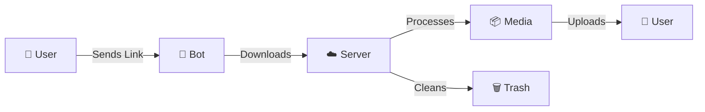

<div align="center">

# 🚀 TelegramRestrictionBypass

### *A Powerful Telegram Content Management Bot*

[](https://www.python.org/)
[](https://docs.pyrogram.org/)
[](LICENSE)
[](https://www.docker.com/)

<p align="center">
  
  
  
</p>

---

### 🎯 Built with Pyrogram • ⚡ High Performance • 🛡️ FloodWait Protection

**Developed by [@Paidguy](https://github.com/Paidguy)**

*Enhanced version based on [RestrictedContentDL](https://github.com/bisnuray/RestrictedContentDL) by [@bisnuray](https://github.com/bisnuray)*

</div>

---

## 📋 Table of Contents

- [✨ Features](#-features)
- [🎬 Demo](#-demo)
- [🙏 Acknowledgments](#-acknowledgments)
- [🔧 Installation](#-installation)
- [⚙️ Configuration](#️-configuration)
- [🚀 Deployment](#-deployment)
- [📖 Usage Guide](#-usage-guide)
- [🏗️ Architecture](#️-architecture)
- [🛠️ Troubleshooting](#️-troubleshooting)
- [🤝 Contributing](#-contributing)
- [📜 License](#-license)
- [⚠️ Legal Disclaimer](#️-legal-disclaimer)

---

## ✨ Features

<table>
<tr>
<td width="50%">

### 🔥 Core Features
- 🎯 **Smart Content Processing** - Handles media, documents, and files
- 🔄 **Multi-Account Rotation** - Prevents rate limiting
- ⚡ **High-Speed Transfers** - TgCrypto acceleration
- 🛡️ **FloodWait Protection** - Intelligent retry mechanisms
- 🧹 **Auto Cleanup** - Prevents disk space issues

</td>
<td width="50%">

### 💎 Advanced Capabilities
- 📦 **Batch Processing** - Queue multiple requests
- 🔐 **Secure Sessions** - Encrypted string storage
- 🌐 **Cloud Optimized** - AWS & VPS ready
- 📊 **Detailed Logging** - Track all operations
- 🐳 **Docker Support** - Easy containerization

</td>
</tr>
</table>

---

## 🎬 Demo

### How It Works



**Simple 3-Step Process:**
1. 📤 **Send** - Forward any Telegram message link
2. ⚙️ **Process** - Bot handles download and processing
3. 📥 **Receive** - Get your content instantly

---

## 🙏 Acknowledgments

This project is an enhanced and optimized version built upon the excellent work of:

<div align="center">

### Original Project: [RestrictedContentDL](https://github.com/bisnuray/RestrictedContentDL)

</div>

### What's New in This Version

This fork adds several production-ready enhancements:

| Enhancement | Description |
|-------------|-------------|
| 🚀 **Performance Optimization** | Improved async processing and queue management |
| 🔄 **Multi-Account Rotation** | Advanced account switching to prevent rate limits |
| 🛡️ **Enhanced FloodWait** | Smarter retry logic with exponential backoff |
| ☁️ **Cloud Deployment** | Optimized for AWS, VPS, and Docker environments |
| 🧹 **Auto-Cleanup** | Intelligent storage management and temp file removal |
| ⚡ **TgCrypto Acceleration** | Maximum speed for encryption/decryption |
| 📊 **Advanced Logging** | Detailed operation tracking and debugging |
| 🔐 **Security Improvements** | Enhanced session management and error handling |

### Credits & Attribution

We extend our gratitude to:
- **[@bisnuray](https://github.com/bisnuray)** - For creating the original RestrictedContentDL bot that served as the foundation
- **Pyrogram Team** - For the excellent MTProto framework
- **Open Source Community** - For continuous support and contributions

> 💡 If you appreciate the original work, please visit [RestrictedContentDL](https://github.com/bisnuray/RestrictedContentDL) and give it a ⭐ star!

---

## 🔧 Installation

### Prerequisites

```bash
✅ Python 3.11 or higher
✅ Telegram API Credentials (API_ID & API_HASH)
✅ Bot Token from @BotFather
✅ Sufficient storage space (500MB+ recommended)
```

### Quick Start

<details>
<summary>📦 <b>Method 1: Standard Installation</b></summary>

```bash
# Clone the repository
git clone https://github.com/Paidguy/TelegramRestrictionBypass.git
cd TelegramRestrictionBypass

# Install dependencies
pip install -r requirements.txt

# Configure your environment
cp config.env.example config.env
nano config.env

# Run the bot
python main.py
```

</details>

<details>
<summary>🐳 <b>Method 2: Docker Installation</b></summary>

```bash
# Clone the repository
git clone https://github.com/Paidguy/TelegramRestrictionBypass.git
cd TelegramRestrictionBypass

# Configure environment
cp config.env.example config.env
nano config.env

# Build and run with Docker Compose
docker-compose up -d

# View logs
docker-compose logs -f
```

</details>

<details>
<summary>☁️ <b>Method 3: AWS Deployment</b></summary>

```bash
# SSH into your EC2 instance
ssh -i your-key.pem ubuntu@your-ec2-ip

# Install Python 3.11
sudo apt update && sudo apt install python3.11 python3-pip -y

# Clone and setup
git clone https://github.com/Paidguy/TelegramRestrictionBypass.git
cd TelegramRestrictionBypass
pip install -r requirements.txt

# Configure
nano config.env

# Run with screen (for background operation)
screen -S telegram_bot
python main.py
# Press Ctrl+A then D to detach
```

</details>

---

## ⚙️ Configuration

### Environment Variables

Create or edit `config.env`:

```env
# ═══════════════════════════════════════
# 🔑 TELEGRAM API CREDENTIALS
# ═══════════════════════════════════════
API_ID=12345678
API_HASH=your_api_hash_here
BOT_TOKEN=123456:ABC-DEF1234ghIkl-zyx57W2v1u123ew11

# ═══════════════════════════════════════
# 🔐 SESSION CONFIGURATION
# ═══════════════════════════════════════
SESSION_STRING=your_session_string_here

# ═══════════════════════════════════════
# ⚙️ PERFORMANCE SETTINGS
# ═══════════════════════════════════════
MAX_CONCURRENT_DOWNLOADS=3
AUTO_DELETE_TIMEOUT=3600
FLOOD_WAIT_MULTIPLIER=1.2

# ═══════════════════════════════════════
# 📊 LOGGING
# ═══════════════════════════════════════
LOG_LEVEL=INFO
```

### Getting Your Credentials

| Credential | How to Get It |
|------------|---------------|
| **API_ID & API_HASH** | Visit [my.telegram.org](https://my.telegram.org) → API Development Tools |
| **BOT_TOKEN** | Message [@BotFather](https://t.me/botfather) on Telegram → `/newbot` |
| **SESSION_STRING** | Run `python generate_session.py` (included in helpers/) |

---

## 🚀 Deployment

### Production Deployment Options

<table>
<tr>
<td width="33%" align="center">

### 🌐 VPS Deployment
```bash
screen -S bot
python main.py
```
**Best for:** Small to medium scale

</td>
<td width="33%" align="center">

### 🐳 Docker Deployment
```bash
docker-compose up -d
```
**Best for:** Easy management

</td>
<td width="33%" align="center">

### ☁️ Cloud Deployment
```bash
systemctl enable bot
systemctl start bot
```
**Best for:** Enterprise scale

</td>
</tr>
</table>

### Systemd Service (Recommended for Production)

Create `/etc/systemd/system/telegram-bot.service`:

```ini
[Unit]
Description=Telegram Restriction Bypass Bot
After=network.target

[Service]
Type=simple
User=ubuntu
WorkingDirectory=/home/ubuntu/TelegramRestrictionBypass
ExecStart=/usr/bin/python3 /home/ubuntu/TelegramRestrictionBypass/main.py
Restart=always
RestartSec=10

[Install]
WantedBy=multi-user.target
```

Enable and start:
```bash
sudo systemctl daemon-reload
sudo systemctl enable telegram-bot
sudo systemctl start telegram-bot
sudo systemctl status telegram-bot
```

---

## 📖 Usage Guide

### Basic Commands

| Command | Description |
|---------|-------------|
| `/start` | Initialize the bot and see welcome message |
| `/help` | Display help information |
| `/status` | Check bot status and statistics |
| `/cancel` | Cancel current operation |

### Step-by-Step Tutorial

**1️⃣ Start the Bot**
```
Send: /start
Bot replies with welcome message
```

**2️⃣ Send Content Link**
```
Copy any Telegram post link
Example: https://t.me/channelname/123
Paste it to the bot
```

**3️⃣ Receive Content**
```
Bot downloads → processes → uploads
You receive the content as a file
```

### Batch Processing

Send multiple links and the bot will process them in queue:
```
Link 1: https://t.me/channel1/100
Link 2: https://t.me/channel2/200
Link 3: https://t.me/channel3/300
```

---

## 🏗️ Architecture

### Project Structure

```
TelegramRestrictionBypass/
├── 📄 main.py                 # Main bot entry point
├── 📄 config.py               # Configuration manager
├── 📄 logger.py               # Logging system
├── 📁 helpers/                # Helper modules
│   ├── download_handler.py   # Download management
│   ├── upload_handler.py     # Upload management
│   └── session_manager.py    # Session handling
├── 📄 requirements.txt        # Python dependencies
├── 📄 Dockerfile             # Docker configuration
├── 📄 docker-compose.yml     # Docker Compose setup
├── 📄 config.env             # Environment variables
└── 📄 README.md              # This file
```

### Technology Stack

<div align="center">

| Technology | Purpose |
|:----------:|:-------:|
|  | Core Language |
|  | Telegram MTProto API |
|  | Containerization |
|  | Cloud Hosting |

</div>

---

## 🛠️ Troubleshooting

### Common Issues & Solutions

<details>
<summary><b>❌ Connection Reset Error</b></summary>

**Problem:** `ConnectionResetError` or frequent disconnections

**Solution:**
```bash
# Disable IPv6 (AWS Debian)
sudo sysctl -w net.ipv6.conf.all.disable_ipv6=1
sudo sysctl -w net.ipv6.conf.default.disable_ipv6=1
```

</details>

<details>
<summary><b>❌ FloodWait Error</b></summary>

**Problem:** `FloodWait` errors from Telegram

**Solution:**
- The bot handles this automatically
- Increase `FLOOD_WAIT_MULTIPLIER` in config
- Use multiple accounts for rotation

</details>

<details>
<summary><b>❌ MD5 Checksum Invalid</b></summary>

**Problem:** `MD5_CHECKSUM_INVALID` error

**Solution:**
- The bot includes automatic retry logic
- Check your network stability
- Verify TgCrypto is installed: `pip install TgCrypto`

</details>

<details>
<summary><b>❌ Disk Full Error</b></summary>

**Problem:** Disk space fills up quickly

**Solution:**
```bash
# Enable auto-cleanup in config.env
AUTO_DELETE_TIMEOUT=1800  # 30 minutes

# Manual cleanup
rm -rf downloads/*
```

</details>

<details>
<summary><b>❌ Bot Not Responding</b></summary>

**Problem:** Bot doesn't reply to messages

**Solution:**
1. Check bot is running: `systemctl status telegram-bot`
2. Verify credentials in `config.env`
3. Check logs: `tail -f logs/bot.log`
4. Restart: `systemctl restart telegram-bot`

</details>

### Debug Mode

Enable detailed logging:

```bash
# In config.env
LOG_LEVEL=DEBUG

# Or run with debug flag
python main.py --debug
```

---

## 🤝 Contributing

We welcome contributions! Here's how you can help:

### Development Setup

```bash
# Fork the repository
git clone https://github.com/yourusername/TelegramRestrictionBypass.git

# Create a branch
git checkout -b feature/your-feature

# Make your changes and commit
git commit -m "Add: your feature description"

# Push and create PR
git push origin feature/your-feature
```

### Contribution Guidelines

- ✅ Follow PEP 8 style guidelines
- ✅ Add comments for complex logic
- ✅ Update documentation
- ✅ Test thoroughly before submitting
- ✅ Maintain the legal disclaimer

---

## 📜 License

This project is licensed under the **MIT License**.

```
MIT License - Copyright (c) 2025

Permission is hereby granted, free of charge, to any person obtaining a copy
of this software and associated documentation files (the "Software"), to deal
in the Software without restriction, including without limitation the rights
to use, copy, modify, merge, publish, distribute, sublicense, and/or sell
copies of the Software...
```

See [LICENSE](LICENSE) file for full details.

---

## 👨‍💻 Developer

<div align="center">

**Created & Maintained by [@Paidguy](https://github.com/Paidguy)**

*Enhanced version based on [RestrictedContentDL](https://github.com/bisnuray/RestrictedContentDL) by [@bisnuray](https://github.com/bisnuray)*

[](https://github.com/Paidguy)
[](https://t.me/paidguy)

*Special thanks to [@bisnuray](https://github.com/bisnuray) for the original codebase*

*If you found this project helpful, consider giving both repos a ⭐ star!*

</div>

---

## 📞 Support & Resources

<div align="center">

[](https://docs.pyrogram.org/)
[](https://core.telegram.org/api)
[](https://github.com/Paidguy/TelegramRestrictionBypass/issues)

</div>

---

## ⚠️ LEGAL DISCLAIMER & IMPORTANT WARNINGS

### 🚨 READ THIS SECTION CAREFULLY BEFORE USING THIS SOFTWARE 🚨

<div align="center">

**THIS SOFTWARE IS PROVIDED FOR EDUCATIONAL AND RESEARCH PURPOSES ONLY**

</div>

---

### ⚖️ Legal Liability & Responsibility

By downloading, installing, or using this software, you acknowledge and agree to the following terms:

#### 1. **Terms of Service Violations**
- ❌ This software may violate [Telegram's Terms of Service](https://telegram.org/tos)
- ❌ Telegram explicitly prohibits bypassing content restrictions and security features
- ❌ Using this bot may result in **permanent account suspension** or termination

#### 2. **Copyright & Intellectual Property**
- 📜 Downloading or redistributing restricted content may violate **copyright laws**
- 📜 Content creators use restrictions to protect their **intellectual property rights**
- 📜 Unauthorized distribution may constitute **copyright infringement**

#### 3. **Criminal Liability**
In many jurisdictions, circumventing access controls may result in:
- ⚖️ Criminal prosecution
- 💰 Substantial fines
- 🔒 Imprisonment
- 📋 Permanent criminal record

**Relevant Laws May Include:**
- Digital Millennium Copyright Act (DMCA) - United States
- EU Copyright Directive - European Union
- Computer Fraud and Abuse Act (CFAA) - United States
- Computer Misuse Act - United Kingdom
- Other anti-circumvention legislation worldwide

---

### 🛡️ Developer Disclaimer

**THE AUTHORS AND COPYRIGHT HOLDERS:**

```
❌ DISCLAIM ALL LIABILITY for damages, losses, or legal consequences
❌ DO NOT ENCOURAGE, ENDORSE, OR CONDONE illegal use
❌ ARE NOT RESPONSIBLE for how you choose to use this software
❌ PROVIDE NO LEGAL PROTECTION or defense for users facing legal action
❌ MAKE NO WARRANTIES about the software's legality in your jurisdiction
```

**THE SOFTWARE IS PROVIDED "AS IS" WITHOUT WARRANTY OF ANY KIND.**

---

### 👤 Your Responsibilities

<div align="center">

### **YOU ARE SOLELY AND COMPLETELY RESPONSIBLE FOR:**

</div>

| Responsibility | Details |
|----------------|---------|
| 📚 **Legal Compliance** | Understanding and complying with all applicable laws in your jurisdiction |
| ✅ **Authorization** | Obtaining proper authorization before accessing or downloading content |
| 🎨 **Creator Rights** | Respecting content creators' rights and restrictions |
| ⚖️ **Legal Consequences** | Any legal consequences that result from your use of this software |
| 🚫 **Account Bans** | Any account suspensions or permanent bans |
| 💰 **Financial Losses** | Any fines, penalties, or financial damages incurred |
| 🔒 **Criminal Charges** | Any criminal charges or prosecution resulting from misuse |

---

### ✅ Recommended Legal Use Cases

This software should **ONLY** be used for:

- 🎓 **Educational research** into Telegram API functionality
- 📚 **Academic purposes** in controlled environments
- 🔒 **Security research** with proper authorization
- 💾 **Personal archival** of content you own or have explicit permission to download
- 🛠️ **Development testing** in isolated environments
- 📊 **Technical documentation** and analysis

---

### ❌ PROHIBITED USES

<div align="center">

### **DO NOT USE THIS SOFTWARE TO:**

</div>

```diff
- ❌ Pirate or redistribute copyrighted content
- ❌ Bypass restrictions on content you don't own
- ❌ Violate any platform's terms of service
- ❌ Infringe on intellectual property rights
- ❌ Engage in commercial distribution of restricted content
- ❌ Download content without proper authorization
- ❌ Circumvent technological protection measures
- ❌ Engage in any illegal activity
```

---

### 🌍 International Legal Considerations

Different countries have different laws. You may be subject to:

| Region | Relevant Laws |
|--------|---------------|
| 🇺🇸 **United States** | DMCA, CFAA, Copyright Act |
| 🇪🇺 **European Union** | Copyright Directive, Data Protection |
| 🇬🇧 **United Kingdom** | Computer Misuse Act, Copyright Law |
| 🇨🇦 **Canada** | Copyright Modernization Act |
| 🇦🇺 **Australia** | Copyright Act, Cybercrime Act |
| 🌏 **Asia-Pacific** | Various national copyright and cybercrime laws |

**Consult a legal professional in your jurisdiction before using this software.**

---

### ⚠️ Risk Acknowledgment

By using this software, you explicitly acknowledge:

1. ✅ You have read and understood this entire legal disclaimer
2. ✅ You accept full legal and financial responsibility for your actions
3. ✅ You will not hold the developers liable for any consequences
4. ✅ You understand the potential for account bans and legal action
5. ✅ You will use this software only for legitimate, legal purposes
6. ✅ You have consulted legal counsel if you have any doubts

---

### 📞 If You Have Legal Concerns

<div align="center">

**🚨 STOP AND CONSULT A LAWYER FIRST 🚨**

Do not use this software if you have any doubts about its legality in your situation.

**No disclaimer can protect you from legal consequences.**

</div>

---

### 🔒 Final Statement

<div align="center">

**This software is a tool. Like any tool, it can be used responsibly or irresponsibly.**

**The developers provide this for educational purposes and take no responsibility for misuse.**

**If you choose to use this software, you do so entirely at your own risk and legal liability.**

</div>

---

<div align="center">

### 💙 Built with Pyrogram | ⚡ Powered by Python | 🛡️ Use Responsibly

**Developed by [@Paidguy](https://github.com/Paidguy)**

**Based on [RestrictedContentDL](https://github.com/bisnuray/RestrictedContentDL) by [@bisnuray](https://github.com/bisnuray)**

**Star ⭐ both repos if you found them helpful!**

---

*Last Updated: December 2025*

</div>
